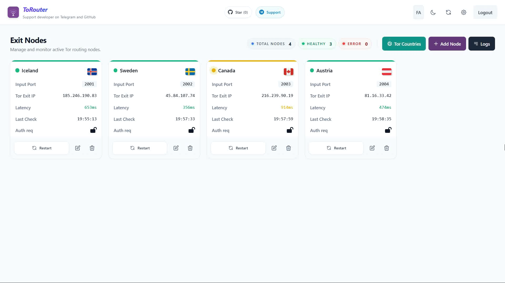
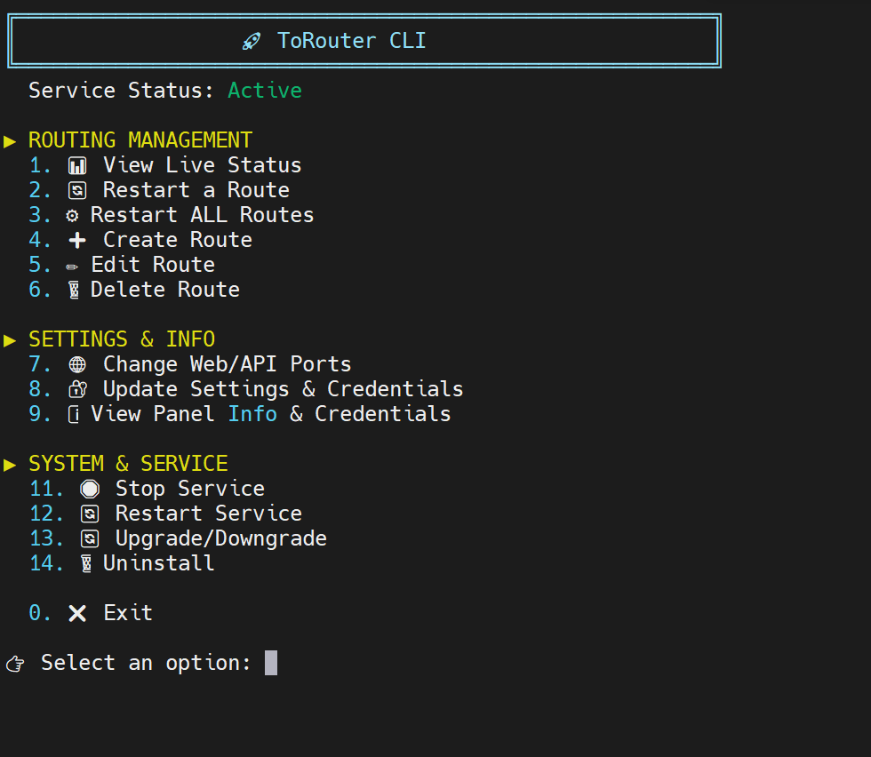

# ToRouter-Multi-Location

برنامه ToRouter یک ابزار قدرتمند مدیریت Tor است که یک سرور واحد را به چندین لوکیشن (بیش از ۵۰ لوکیشن) با IP و کشور خروجی متفاوت و قابل تنظیم تبدیل می‌کند. این ابزار با پشتیبانی از چندین تونل مستقل، چرخش خودکار مسیرها، مانیتورینگ زنده، CLI، SQLite و API منعطف، راهکاری ایده‌آل برای مدیریت حرفه‌ای مسیرهای Tor و حفظ حریم خصوصی است.

## امکانات اصلی

- 🧭 مدیریت چند مسیر مستقل با تنظیم کشور خروجی
- ⚡ نمایش زنده وضعیت هر مسیر و تأخیر شبکه
- 🔄 تغییر خودکار مسیر تور بر اساس بازه زمانی قابل تنظیم
- 🔐 ورود و تنظیمات محافظت‌شده با حساب مدیریت
- 🌐 پنل وب و رابط خط فرمان برای دسترسی آسان
- 🗃️ ذخیره‌سازی تنظیمات و وضعیت خروجی تور در پایگاه داده SQLite

## چرا این برنامه جذاب است؟

- مناسب برای کاربرانی که می‌خواهند با فقط یک VPS چندین لوکیشن متفاوت و قابل انتخاب داشته باشند.
- محیط CLI ساده و تعاملی برای نمایش زنده و عملیات سریع
- ذخیره وضعیت آخرین IP خروجی و زمان آخرین بررسی
- ترکیب مدیریت محلی و API برای ساخت ابزارهای سفارشی

# 🎥 نمای وب پنل مدیریت:
<p align="center">
  
</p>

## ⌨️ منوی تعاملی CLI
این برنامه دارای یک منوی CLI کاملاً تعاملی است که با دستور `tor-p` در خط فرمان سرور شما در دسترس قرار می‌گیرد. ویژگی‌ها و قابلیت‌های منوی CLI شامل موارد زیر است:

- **مدیریت هوشمند و پویا:** نمایش گزینه‌ها بر اساس وضعیت فعال/غیرفعال بودن سرویس `ToRouter.service`.
- **کنترل سرویس و سیستم:** شروع، توقف، راه‌اندازی مجدد (Restart)، آپگرید/داون‌گرید آسان و حتی حذف کامل برنامه.
- **عملیات مسیریابی (Routing):** افزودن، ویرایش، حذف و ری‌استارت مسیرهای تور به صورت تک‌تک یا گروهی.
- **مانیتورینگ زنده:** مشاهده وضعیت زنده مسیرها شامل تاخیر (Latency) و IP هر لوکیشن.
- **تنظیمات:** تغییر پورت‌های Web و API، تغییر رمز عبور پنل وب و نمایش سریع اطلاعات لازم برای ورود به پنل.

<p align="center">
  
</p>

## شروع سریع

برای نصب، راه‌اندازی و مدیریت برنامه می‌توانید از اسکریپت نصب استفاده کنید:

# نصب کامل آخرین نسخه (بدون آرگومان)
```bash
curl -s https://raw.githubusercontent.com/ArashAfkandeh/ToRouter-Multi-Location/main/install.sh | sudo bash
```

# به‌روزرسانی برنامه
```bash
curl -s https://raw.githubusercontent.com/ArashAfkandeh/ToRouter-Multi-Location/main/install.sh | sudo bash -s -- update
```

# نصب نسخه خاص
```bash
curl -s https://raw.githubusercontent.com/ArashAfkandeh/ToRouter-Multi-Location/main/install.sh | sudo bash -s -- --version v0.1.0
```

# شروع سرویس
```bash
curl -s https://raw.githubusercontent.com/ArashAfkandeh/ToRouter-Multi-Location/main/install.sh | sudo bash -s -- start
```

# توقف سرویس
```bash
curl -s https://raw.githubusercontent.com/ArashAfkandeh/ToRouter-Multi-Location/main/install.sh | sudo bash -s -- stop
```

# حذف کامل
```bash
curl -s https://raw.githubusercontent.com/ArashAfkandeh/ToRouter-Multi-Location/main/install.sh | sudo bash -s -- uninstall
```

# مشاهده راهنما
```bash
curl -s https://raw.githubusercontent.com/ArashAfkandeh/ToRouter-Multi-Location/main/install.sh | sudo bash -s -- --help
```

# ترکیب آرگومانها (مثال: نصب نسخه خاص و شروع)
```bash
curl -s https://raw.githubusercontent.com/ArashAfkandeh/ToRouter-Multi-Location/main/install.sh | sudo bash -s -- --version v0.1.0 start
```

### اجرای دستی (برای توسعه‌دهندگان)

```bash
cd /root/ToRouter-Multi-Location
./build.sh
./dist/ToRouter --run
```

اجرا با وب پنل:

```bash
./dist/ToRouter --web-dir ./web
```

## پشتیبانی چند کشور خروجی

**توروتر** امکان تعریف و حفظ چند مسیر تور با خروجی از کشورها و سرورهای متفاوت را فراهم می‌کند؛ هر مسیر می‌تواند به صورت مستقل سوئیچ شود و وضعیت IP خروجی در بازه‌های زمانی مشخص ثبت شود.

نمونه کشورهای خروجی دریافتی:

- 🇺🇸 امریکا
- 🇩🇪 آلمان
- 🇳🇱 هلند
- 🇫🇷 فرانسه
- 🇸🇬 سنگاپور
- 🇯🇵 ژاپن
- 🇧🇷 برزیل
- 🇨🇦 کانادا

## ساختار پروژه

- `daemon/`: هسته اصلی Rust برای سرویس تور و API
- `dist/`: باینری نهایی و فایل‌های اجرایی تولید شده
- `webpanel/`: فایل‌های رابط وب

## پیام نهایی

**توروتر** برای کنترل حرفه‌ای مسیرهای تور و حفظ حریم خصوصی با دیدی واضح و رابط کاربری ساده توسعه داده شده است.
